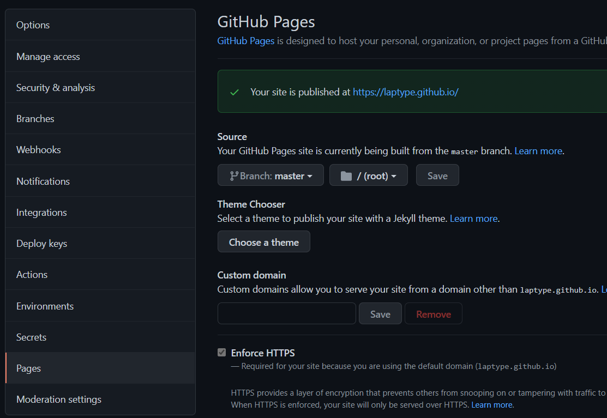

今天重建了博客，因为之前博客source文件被删了也没有备份，所以想重建一个可以自带备份部署文件的博客，方便维护，记录一下

主要看的教程：

https://www.zhihu.com/question/21193762/answer/489124966

https://www.jianshu.com/p/0b1fccce74e0

原理就是

`hexo d`上传到GitHub的是hexo编译之后的文件，不包含源文件

所以，就新建一个分支，用来保存源文件。

GIF测试

